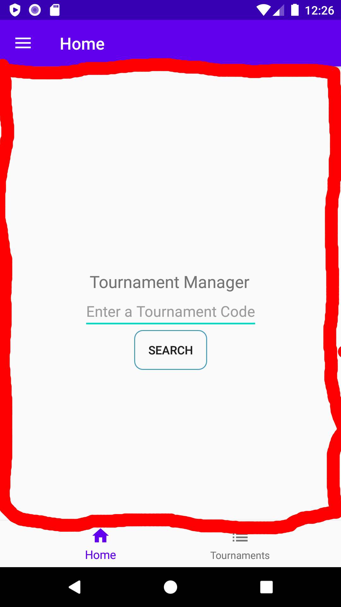

# Tournament Manager App

Egill Ragnarsson

Flóki Þorleifsson

Guðmundur Óli Norland

Hjalti Geir Garðarsson

---

## Information

* [App Github](https://github.com/slowpokesheep/tournamentmanager)
* [Slides](https://slowpokesheep.github.io/tm_app_presentation/#/)
  * **Frontend**
    * [Github](https://github.com/nachos5/tm_manager_frontend)
    * [Heroku](https://tmmanagerbackend.herokuapp.com/)
  * **Backend**
    * [Github](https://github.com/nachos5/tm_manager_backend)
    * [Heroku](https://tmmanagerfrontend.herokuapp.com/)

---

## Architecture & Design

---

## Technology

----

### Backend

- Django
  - Backend framework written in python
- GraphQL
  - Open-source data query and manipulation language for APIs.
  - **Graphene:** library for building GraphQL APIs in Python easily
- PostgreSQL
  - Open-source relational database management system.

----

### Frontend

- Java (Android Studio)
  - App framework written in java
- Apollo Client
  - A complete state management library for JavaScript apps.

---

## Models

----
### Class Diagram
</img>

----
### State Machine Diagram
</img>

----
### Sequence Diagram
</img>

---

## Key design decisions

---

### Fragments over activities

</img>

----

### Fragment

```java
public class HomeFragment extends Fragment {

    private HomeViewModel homeViewModel;

    public View onCreateView(@NonNull LayoutInflater inflater, ViewGroup container, Bundle savedInstanceState) {
        View root = inflater.inflate(R.layout.fragment_home, container, false);
        homeViewModel = new ViewModelProvider(this).get(HomeViewModel.class);

        Button findTournamentButton = root.findViewById(R.id.find_tournament_button);

        // Search button listener
        findTournamentButton.setOnClickListener(v -> {
            EditText text = root.findViewById(R.id.find_tournament_text);
            String code = text.getText().toString();
            homeViewModel.fetchTournaments(code);
        });

        observeViewModel();

        return root;
    }
}
```

----

### ViewModel

```java
public class HomeViewModel extends ViewModel {

    private final MutableLiveData<TournamentInfoQuery.Data> infoObservable =
            new MutableLiveData<>();

    public MutableLiveData<TournamentInfoQuery.Data> getInfoObservable() {
        return infoObservable;
    }

    public void fetchTournaments(String code) {
        ApiRepository.getInstance().getTournamentInfo(infoObservable, code);
    }
}
```

----

```
ui
├── authentication
│   ├── LoginFragment.java
│   ├── LoginViewModel.java
│   └── RegisterDialogFragment.java
├── collections
│   ├── CollectionAdapter.java
│   ├── CollectionProfileFragment.java
│   ├── CollectionTournamentFragment.java
│   └── CollectionTournamentsFragment.java
├── home
│   ├── HomeFragment.java
│   └── HomeViewModel.java
├── newtournament
│   ├── NewTournamentFragment.java
│   └── NewTournamentViewModel.java
├── profile
│   ├── ProfileFragment.java
│   └── ProfileViewModel.java
└── tournaments
    ├── filters
    │   └── CategoryFilterDialogFragment.java
    ├── TournamentBracket.java
    ├── TournamentBracketViewModel.java
    ├── TournamentInfoFragment.java
    ├── TournamentInfoViewModel.java
    ├── TournamentListAdapter.java
    ├── TournamentRegisterFragment.java
    ├── TournamentRegisterViewModel.java
    ├── TournamentsFragment.java
    └── TournamentsViewModel.java

```

----

### Collections

- Used to bundle fragments together

```java
tournamentsCollectionAdapter = new CollectionAdapter(this);
        tournamentsCollectionAdapter.add(TournamentInfoFragment.newInstance(code), "Info");
        tournamentsCollectionAdapter.add(TournamentRegisterFragment.newInstance(code), "Participants");
        tournamentsCollectionAdapter.add(TournamentBracket.newInstance(code), "Bracket");
```

----

</img>

---

## Key features

----

### Login


----

### Profile


----

### New Tournament


----

### Tournament Info


----

### Tournament Code


---

### Complete integration

----

* The website and the app share the same backend
  * Any changes made in the app are reflected on the website and vice versa
* You can be logged into our website and app simultaneously

----


----


---

## Software Process

----

- The core concept was decided upon pretty early own
- Development started out slow with the set up of our environment

----

### Challenges

- The construction of our foundation
  - Communication between our two modes of navigations
  - Connection between the fragment, viewmodel and our backend
  - Proper mangement of the logged in state

----

### Solutions

- A lot of time digging through documentations
- We managed to seperate the fragment, viewmodel and our backend communication
- User data and the login state are managed by a special class called **SharedPref**

---

## Conclusion

----

### Success

- Clear vision shared among all members of the group
- Good communication
- Clean and modular frontend, due to our fragments
- The scope of the project

----

### Failure

- Underestimation of the setup of the fragments and viewmodels
- Underestimation of the complexity of the android api and the apollo java client